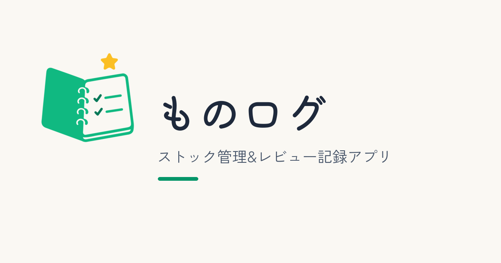
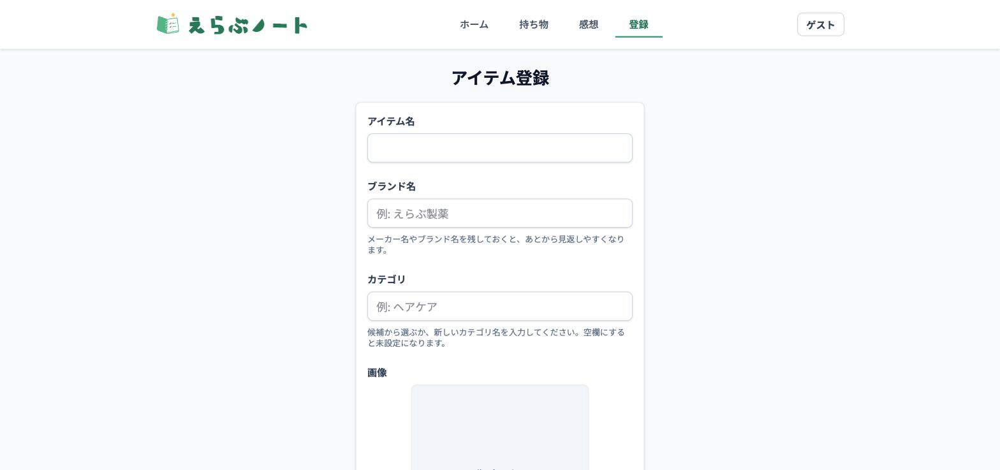
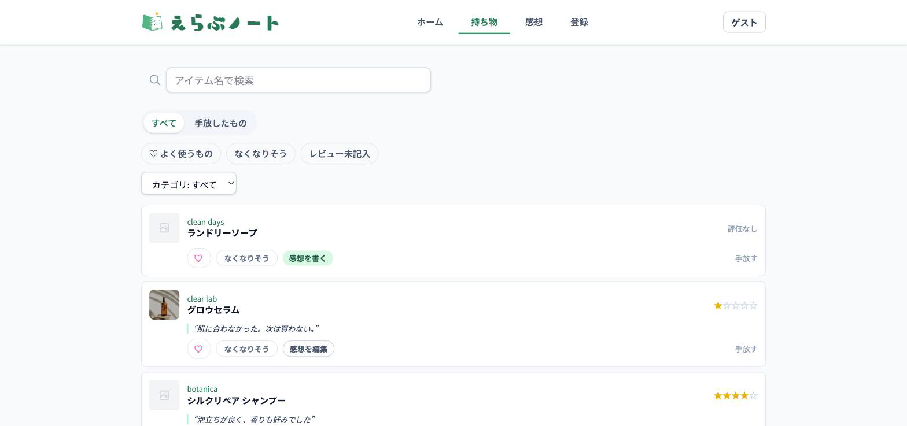
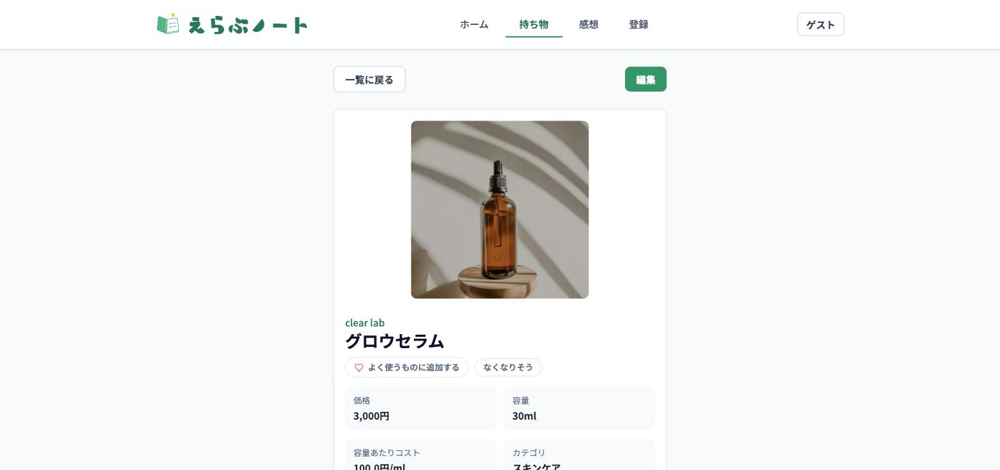
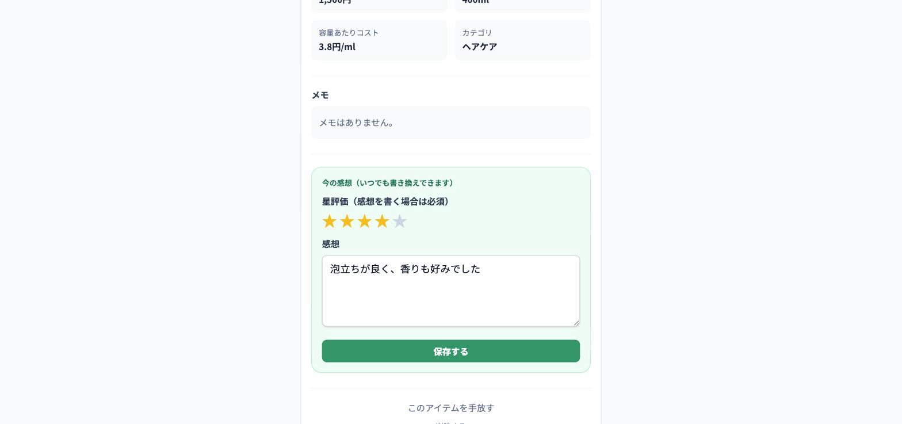
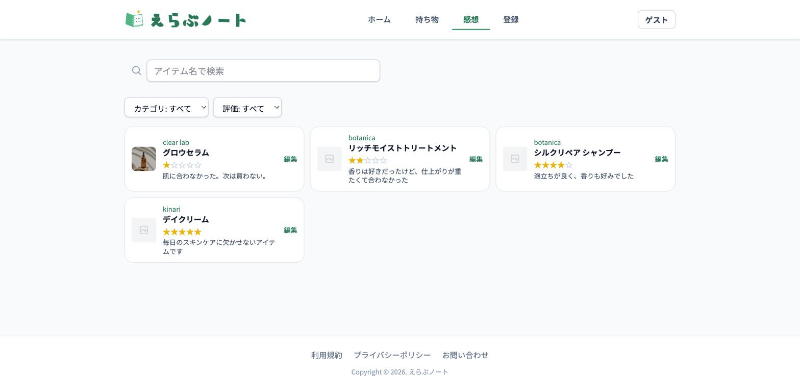

# えらぶノート

## サービス概要

えらぶノートは、化粧品や日用品を選ぶときの判断をサポートする、個人向けのアイテム管理アプリです。

アイテム名・ブランド名・カテゴリ・画像・メモを登録し、使った感想を評価とレビューとして残せます。過去の自分の感想をストックしていくことで、「自分は何が好きか」がわかっていき、次の買い物を楽しく選べるようになります。

在庫管理だけで終わらせず、「前に使ったときどうだったか」「また買いたいか」を自分用のログとして残していくことができます。

## アプリURL

https://monolog-note.com/

## このサービスへの思い・作りたい理由

化粧品や日用品などをいろいろ試すのが好きで、1つのアイテム（シャンプー、アイシャドウ、リップなど）でも複数種類を持っています。

そうした中で、それぞれのアイテムにお気に入りポイントがあって選んでいるはずなのに、どこが良かったか忘れていたり、何を使ったことがあるかさえ忘れてしまったりすることがありました。

もっと自分のお気に入りのアイテムを大切にしたい、好きなものが見つかれば日々がもっと楽しくなる――そんな思いでこのアプリを作りました。

自分で決めることは幸福度を上げる一方で、選択肢が多すぎるとストレスにもなります。えらぶノートは、その矛盾に寄り添い、「自分で選ぶ」体験をサポートすることを目指しています。

## ユーザー層について

### メインターゲット

日用品や化粧品などを、自分なりに選んで使いたい人

### サブターゲット

家庭内の日用品を管理している人

ストック管理をしながら、使ったものの感想も残しておきたい人

## 背景

日用品は、購入頻度が高く、種類も多いため、頭の中だけで管理し続けるのが難しくなりがちです。人間の記憶力はそれほど良くないので、売り場で多くの商品を前に悩むより、自分の記録を参考に選べる方が、選択のストレスが減ります。

他人の評価も参考にはなりますが、結局は自分に合うかどうかが大事です。えらぶノートは、持ち物の状態と自分自身の感想を同じ場所で管理することで、買いすぎを防ぎながら、自分に合うアイテムを見つけやすくすることを目指しています。

## サービス利用のイメージ

1. アイテム名、ブランド名、カテゴリ、価格、容量、画像、メモを登録する（気に入っていれば感想も一緒に）
2. アイテム一覧で、持っているものを確認する。「よく使うもの」「なくなりそう」で絞り込める
3. 使い切りそうになったら「なくなりそう」フラグを立て、リピートするか別のものを試すか検討する
4. 使い終えたら評価とレビューを残す。合わなかった場合は「手放す」ことで、持ち物一覧から「手放したもの」に移す（感想は残る）
5. 「感想を振り返る」画面から、過去の評価・レビューを検索・絞り込みして見返す

## 機能一覧

| 画面 | 内容 |
| --- | --- |
| トップ | サービス概要、ログイン/新規登録/ゲストログインへの導線 |
| 使い方 | アプリの基本的な使い方をスクリーンショット付きで表示 |
| ログイン | メールアドレスとパスワードでログイン、またはゲストとして試す |
| 新規登録 | アカウント作成（LINE連携にも対応） |
| ホーム | なくなりそうなもの、レビュー未記入のもの、よかった/イマイチだったものを表示 |
| 持ち物一覧 | 登録済みアイテムの一覧表示、検索、カテゴリ絞り込み、範囲（すべて/手放したもの）、属性（よく使うもの/なくなりそう/レビュー未記入）での絞り込み |
| アイテム登録 | アイテム名、ブランド名、カテゴリ、価格、容量、画像、メモ、（任意で）評価・感想を登録 |
| アイテム詳細 | カテゴリ、ブランド名、容量あたりコスト、評価・感想を確認。よく使うもの/なくなりそうのトグル、手放す操作 |
| アイテム編集 | 登録内容の更新、画像削除 |
| 感想を振り返る | 評価・レビューを検索、カテゴリ絞り込み、評価絞り込みで表示 |
| お問い合わせ | Googleフォームへの導線 |
| 利用規約 | 静的ページ |
| プライバシーポリシー | 静的ページ |

## 主な機能の詳細

### アイテム登録・編集

アイテム名、ブランド名、カテゴリ、価格、容量、画像、メモを登録できます。カテゴリは既存カテゴリから選ぶだけでなく、登録・編集時に新しいカテゴリ名を入力して追加できます。「レビューを書きたいから登録する」という動線にも対応するため、登録時に評価・感想も一緒に残せます。

登録後はアイテム情報を編集でき、画像を変更したい場合は登録済み画像の削除にも対応しています。

### 持ち物の状態管理

アイテムは「よく使うもの」「なくなりそう」というフラグで管理します。なくなりそうなものは、リピートするか別のものを試すか判断するタイミングを知らせる役割です。

使わなくなったアイテムは「手放す」ことでアーカイブされ、持ち物一覧から「手放したもの」タブに移動します。削除ではないため、感想は手放した後も参照できます。

### レビュー管理

評価とレビューはアイテムに直接ひもづき、いつでも上書き編集できます。「感想を振り返る」画面では、アイテム名、カテゴリ、評価で絞り込みながら過去の感想を探せます。

ホーム画面には、なくなりそうなもの・レビュー未記入のもの・よかった/イマイチだったものが表示され、次にやることが一目でわかるようになっています。

## 主要画面の利用イメージ

### 持ち物一覧

登録済みアイテムを一覧で確認できます。検索、カテゴリ、範囲（すべて/手放したもの）、属性（よく使うもの/なくなりそう/レビュー未記入）を組み合わせて絞り込めるため、目的に応じてすぐ見つけられます。

### アイテム詳細

カテゴリ、ブランド名、容量あたりのコスト、評価・感想を確認できます。評価・感想はこの画面でいつでも編集でき、よく使うもの/なくなりそうのトグル、手放す操作の入口にもなっています。

### 感想を振り返る

過去の評価やレビューを検索・絞り込みして見返せます。買い物前に「前に使ってどうだったか」を確認するための画面です。

## 画面イメージ

| アイテム登録 | アイテム一覧 |
| --- | --- |
|  |  |

| アイテム詳細 | 使い切り入力 |
| --- | --- |
|  |  |

| レビュー入力 | レビュー一覧 |
| --- | --- |
|  |  |

## 使用技術

| 項目 | 技術 |
| --- | --- |
| バックエンド | Ruby 3.2.2 / Ruby on Rails 8.1.3.1 |
| フロントエンド | Tailwind CSS / Hotwire（Turbo, Stimulus） |
| データベース | PostgreSQL |
| 認証 | Devise |
| 画像管理 | Active Storage / Cloudflare R2 / image_processing / libvips |
| ページネーション | Kaminari |
| i18n | rails-i18n / devise-i18n |
| テスト | Minitest |
| CI | GitHub Actions |

## デプロイ

- アプリ: Render / DB: Neon
- `main` へのマージ時は GitHub Actions の CI（テスト・Rubocop）のみ実行され、自動デプロイはされない
- デプロイは GitHub Actions の `Deploy to Render` ワークフロー（`.github/workflows/deploy.yml`）を手動実行（`workflow_dispatch`）することで行う。実行するとテスト・Rubocopが通った場合のみ Render の Deploy Hook を叩く
- マイグレーションは Render 上のコンテナ起動時（`bin/docker-entrypoint`）に `bin/rails db:prepare` として自動実行される

### 必要な GitHub repository secrets

| 名前 | 内容 |
| --- | --- |
| `RENDER_DEPLOY_HOOK_URL` | Render のサービス設定にある Deploy Hook のURL |

## 使用技術の選定理由

### Ruby on Rails

認証、CRUD、ルーティング、画像アップロードなど、Webアプリに必要な基本機能を効率よく実装できるため採用しました。

### Hotwire（Turbo / Stimulus）

Rails標準の仕組みを活かしながら、画像プレビューや操作導線などの小さな体験改善を行いやすいため採用しました。

### Tailwind CSS

スマートフォンでの見やすさや、カード・ボタン・フォームの余白を細かく調整しやすいため採用しました。

### Active Storage / image_processing / libvips

アイテム画像を登録し、一覧用と詳細用で適切なサイズに変換して表示するために採用しました。

### Minitest / GitHub Actions

モデル・コントローラの主要な挙動をテストし、GitHub Actionsで継続的に確認できるようにしています。

## 技術的に工夫した点

### アイテムが状態を直接持つ設計

アイテムの状態（よく使うもの・なくなりそう・手放した）や評価・レビューは、履歴テーブルを介さず `items` が直接持ちます。過去の使用サイクルごとの時系列比較よりも、「今どうか」をシンプルに扱えることを優先した設計です。

`archived`（手放した）は削除ではなくアーカイブとして扱い、感想は手放した後も参照できます。

### 絞り込みの設計

持ち物一覧では、「範囲」（すべて/手放したもの、排他的）と「属性タグ」（よく使うもの/なくなりそう/レビュー未記入、複数を同時に選べる）を分けて絞り込めるようにしています。カテゴリの絞り込みは別軸として扱っています。

### 画像表示の最適化

Active Storageのvariantを使い、一覧用のサムネイル画像と詳細用のプレビュー画像でサイズを分けています。

画面に合わせた画像サイズを使うことで、表示の見やすさと読み込みやすさの両方を意識しています。スマートフォンでは、画像アップロード時に撮影とファイル選択の導線を分け、操作しやすいようにしています。

## 差別化ポイント

### 競合サービス分析

LIPS・@cosmeなどの口コミサイトは他人のレビューを参考にする設計、zaicoなどの在庫管理アプリは「何を持っているか」を管理する設計です。「自分自身の感想を記録し、次に選ぶときの判断材料にする」という視点を両立したサービスは多くありません。

### 当サービスの差別化ポイント

- 持ち物の状態管理とレビュー記録を同じアプリ内で扱える
- 他人の評価ではなく、自分が選んだものの記録・感想を蓄積していく
- 使い終えた後、または手放した後も評価とレビューを残せるため、次回購入の判断材料になる
- 日用品や化粧品など、繰り返し買うアイテムの振り返りに特化している

## 今後の実装予定

今後は、より継続的に使いやすいサービスにするため、以下のような機能追加・改善を検討しています。

- 購入リマインド通知
- お気に入りアイテムの公開やSNS共有
- アイテム登録を簡単にするためバーコードスキャン機能を導入

## ER図

