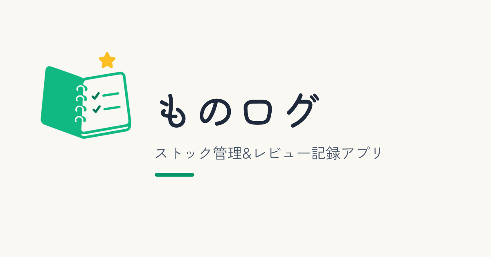
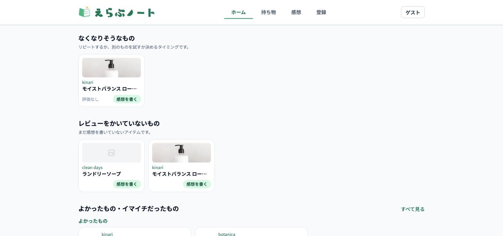
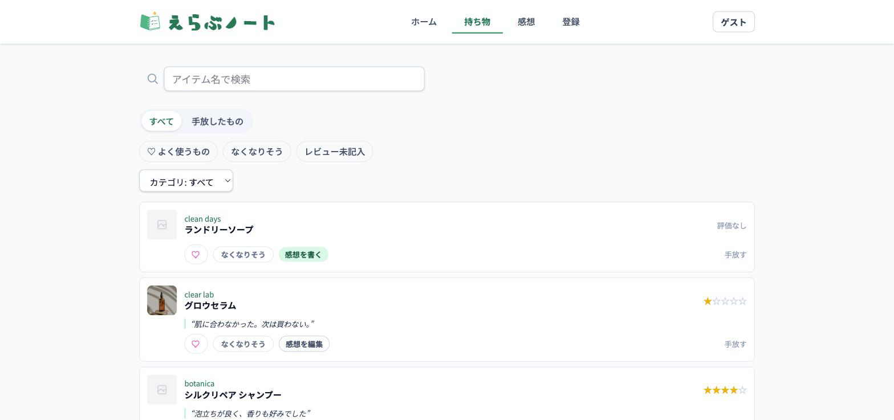
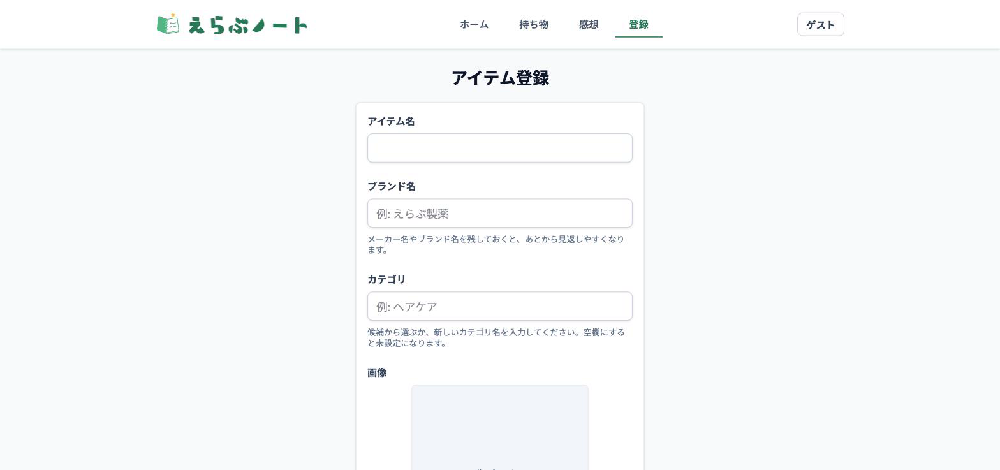
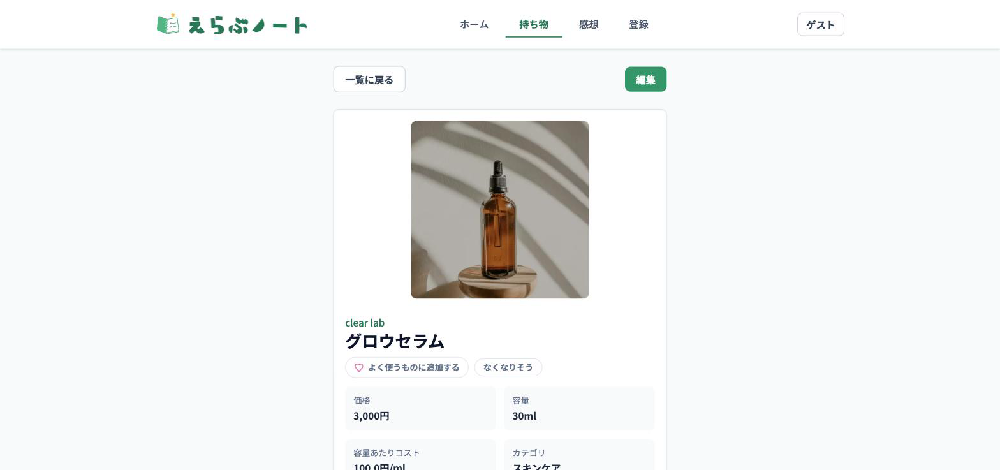
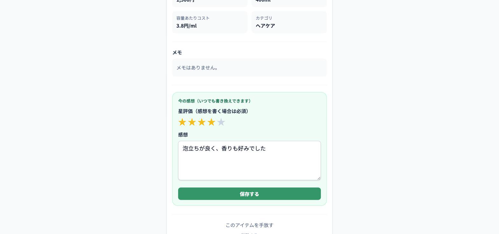
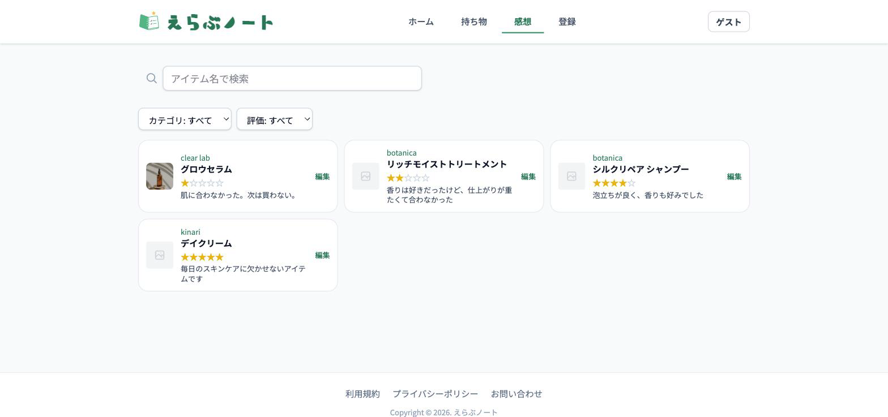
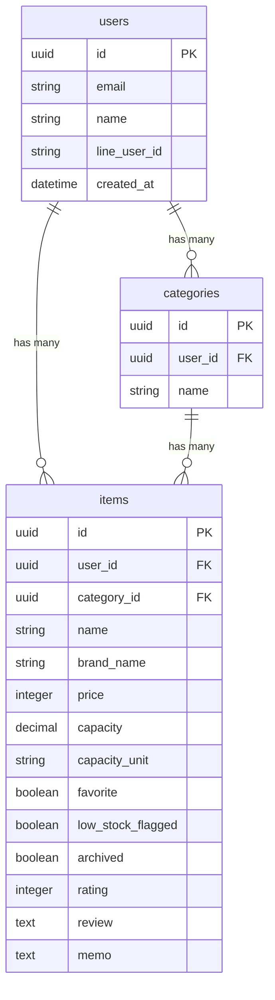

# えらぶノート

## サービス概要

えらぶノートは、化粧品や日用品を選ぶときの判断をサポートする、個人向けのアイテム管理アプリです。

アイテム名・ブランド名・カテゴリ・画像・メモを登録し、使った感想を評価とレビューとして残せます。過去の自分の感想をストックしていくことで、「自分は何が好きか」がわかっていき、次の買い物を楽しく選べるようになります。

「なくなりそう」フラグを立てておくと、次になくなったタイミングで「またリピートするか、別のものを試すか」を考えるきっかけになります。細かい在庫数までは管理せず、次の選択を後押しするための軽い目印として使えます。

## アプリURL

https://monolog-note.com/

## このサービスへの思い・作りたい理由

化粧品や日用品などをいろいろ試すのが好きで、1つのアイテム（シャンプー、アイシャドウ、リップなど）でも複数種類を持っています。

そうした中で、それぞれのアイテムにお気に入りポイントがあって選んでいるはずなのに、どこが良かったか忘れていたり、何を使ったことがあるかさえ忘れてしまったりすることがありました。

もっと自分のお気に入りのアイテムを大切にしたい、好きなものが見つかれば日々がもっと楽しくなる――そんな思いでこのアプリを作りました。他人の評価も参考にはなりますが、結局は自分に合うかどうかが大事です。自分自身の感想を記録として残していくことで、次に何を選ぶかの判断材料にできます。

自分で決めることは幸福度を上げる一方で、選択肢が多すぎるとストレスにもなります。えらぶノートは、その矛盾に寄り添い、「自分で選ぶ」体験をサポートすることを目指しています。

## ユーザー層について

### メインターゲット

日用品や化粧品などを、自分なりに選んで使いたい人

### サブターゲット

家庭内の日用品を管理している人

## 主な機能

### ホーム

  

なくなりそうなもの・レビュー未記入のもの・よかった/イマイチだったものが並びます。

### 持ち物一覧

  

登録済みアイテムを一覧表示。検索、カテゴリ、範囲（すべて/手放したもの）、属性（よく使うもの/なくなりそう/レビュー未記入）を絞り込み表示できます。

### アイテム登録

  

アイテム名、ブランド名、カテゴリ、価格、容量、画像、メモを登録できます。カテゴリは既存カテゴリから選ぶだけでなく、登録・編集時に新しいカテゴリ名を入力して追加できます。
登録と同時にレビューも残せます。

### アイテム詳細

  

カテゴリ、ブランド名、容量あたりのコスト、評価・感想を確認できます。よく使うもの/なくなりそうのトグル、手放す操作もここから行えます。使わなくなったら「手放す」ことでアーカイブでき（削除ではないため感想は残ります）、持ち物一覧の「手放したもの」タブに移動します。

### 感想入力

  

評価とレビューだけをシンプルに入力できる専用画面です。アイテムに直接ひもづき、いつでも上書き編集できます。

### 感想を振り返る

  

過去の評価やレビューを検索・絞り込みして見返せます。買い物前に「前に使ってどうだったか」を確認するための画面です。

## その他の機能

| 画面 | 内容 |
| --- | --- |
| トップ | サービス概要、ログイン/新規登録/ゲストログインへの導線 |
| ログイン | メールアドレスとパスワードでログイン |
| ゲストログイン | アカウント登録なしで、サンプルデータ入りの状態からすぐ試せる |
| 新規登録 | アカウント作成（LINE連携にも対応） |
| アイテム編集 | 登録内容の更新、画像削除 |
| お問い合わせ | Googleフォームへの導線 |

## 技術スタック

- Ruby / Rails 8
- PostgreSQL（Neon）
- Render（本番）
- Docker（開発）
- Tailwind CSS
- Devise / omniauth-oauth2
- Active Storage（Cloudflare R2 / image_processing / libvips）
- Minitest / GitHub Actions

## 使用技術の選定理由

### Ruby on Rails

認証、CRUD、ルーティング、画像アップロードなど、Webアプリに必要な基本機能を効率よく実装できるため採用しました。

### PostgreSQL

MySQLやSQLiteと比較して、デプロイ先のRenderやNeonで標準的にサポートされており親和性が高いと考え採用しました。

### Neon

当初はRenderの無料PostgreSQLでDBを運用していましたが、90日で有効期限が切れる制約があったため、期限のないPostgreSQL互換のサーバーレスDBであるNeonに移行しました。

### Render

GitHub連携で簡単にデプロイでき、Webサービスの無料枠を継続的に使えるため採用しました。

### Docker

ローカル環境に依存せず、バージョンを固定した状態で安定した開発ができることと、今後のチーム開発を意識し、実務でも広く使われていることから採用しました。

### Tailwind CSS

UIを細かく調整でき、デザインに統一感を持たせやすいことに加え、スマートフォン利用を前提としたモバイルファーストの考え方とアプリの相性が良いと考えたため採用しました。

### Devise

認証機能を自前で実装するとパスワード・セッション等セキュリティ面でのリスクが大きいため、Railsで実績があり広く使われているDeviseを採用しました。

### omniauth-oauth2（LINE認証）

LINE認証は既存の`omniauth-line`gemではなく、`omniauth-oauth2`を土台として独自のストラテジを実装しました。既存gemは長期間メンテナンスがされていないためです。

### Cloudflare R2

個人開発でランニングコストを抑えたく、無料枠が大きいCloudflare R2をActive Storageの本番環境での画像保存先として採用しました。

### Minitest / GitHub Actions(CI/CD)

MinitestはRails標準機能で、追加設定の手間が少なく済むため採用しました。
シンプルな分テスト数を増やしてカバーしています。
CI/CDで自動チェック後にマージします。

## 技術的に工夫した点

### アイテムが状態を直接持つ設計

当初は使用開始・終了を履歴として記録する設計でしたが、運用してみて「使用中フラグの管理が煩雑」と気づき、アプリのテーマ（選ぶための情報を溜めておくこと）に立ち返ってシンプルな設計に作り直しました。状態や評価・レビューは履歴テーブルを介さず `items` が直接持ち、「手放した」は削除ではなくアーカイブとして感想を残します。

### 絞り込みの設計

持ち物一覧では「範囲」（すべて/手放したもの）と「属性タグ」（よく使うもの/なくなりそう/レビュー未記入、複数選択可）を別軸で絞り込めるようにしています。

### 画像表示の最適化

Active Storageのvariantで一覧用サムネイルと詳細用プレビューのサイズを分け、表示速度と見やすさを両立しています。

## 差別化ポイント

### 競合サービス分析

LIPS・@cosmeなどの口コミサイトは他人のレビューを参考にする設計、zaicoなどの在庫管理アプリは「何を持っているか」を管理する設計です。「自分自身の感想を記録し、次に選ぶときの判断材料にする」という視点を両立したサービスは多くありません。

### 当サービスの差別化ポイント

- 持ち物の状態管理とレビュー記録を同じアプリ内で扱える
- 他人の評価ではなく、自分が選んだものの記録・感想を蓄積していく
- 使い終えた後、または手放した後も評価とレビューを残せるため、次回購入の判断材料になる
- 日用品や化粧品など、繰り返し買うアイテムの振り返りに特化している

## ER図

現在の実装のテーブル構成です。共有機能で追加予定のテーブルは [共有機能 設計メモ](docs/sharing-plan.md) を参照してください。

```mermaid
erDiagram
    users ||--o{ categories : "has many"
    users ||--o{ items : "has many"
    categories ||--o{ items : "has many"

    users {
        uuid id PK
        string email
        string name
        string line_user_id
        datetime created_at
    }

    categories {
        uuid id PK
        uuid user_id FK
        string name
    }

    items {
        uuid id PK
        uuid user_id FK
        uuid category_id FK
        string name
        string brand_name
        integer price
        decimal capacity
        string capacity_unit
        boolean favorite
        boolean low_stock_flagged
        boolean archived
        integer rating
        text review
        text memo
    }
```

`items` は画像を1枚まで添付できます（Active Storage）。

## 今後の実装予定

### 感想の共有機能（段階的にリリース予定）

ユーザーからの「良かった・合わなかったを教え合いたい」という要望をもとに、自分の感想を公開し、好みが近い人の感想を参考にできる機能を追加します。

1. 感想の公開と、LINE での共有
2. プロフィールページ
3. ユーザー検索・フォロー・タイムライン
4. 「参考になった」と保存

設計の詳細は [共有機能 設計メモ](docs/sharing-plan.md) を参照してください。

### その他（検討中）

- アイテム登録を簡単にするためのバーコードスキャン
- 「なくなりそう」になったアイテムを、前回の感想と一緒に LINE で知らせる通知

機能を追加・削除するときの判断基準は [設計の原則と判断の記録](docs/design-principles.md) にまとめています。
