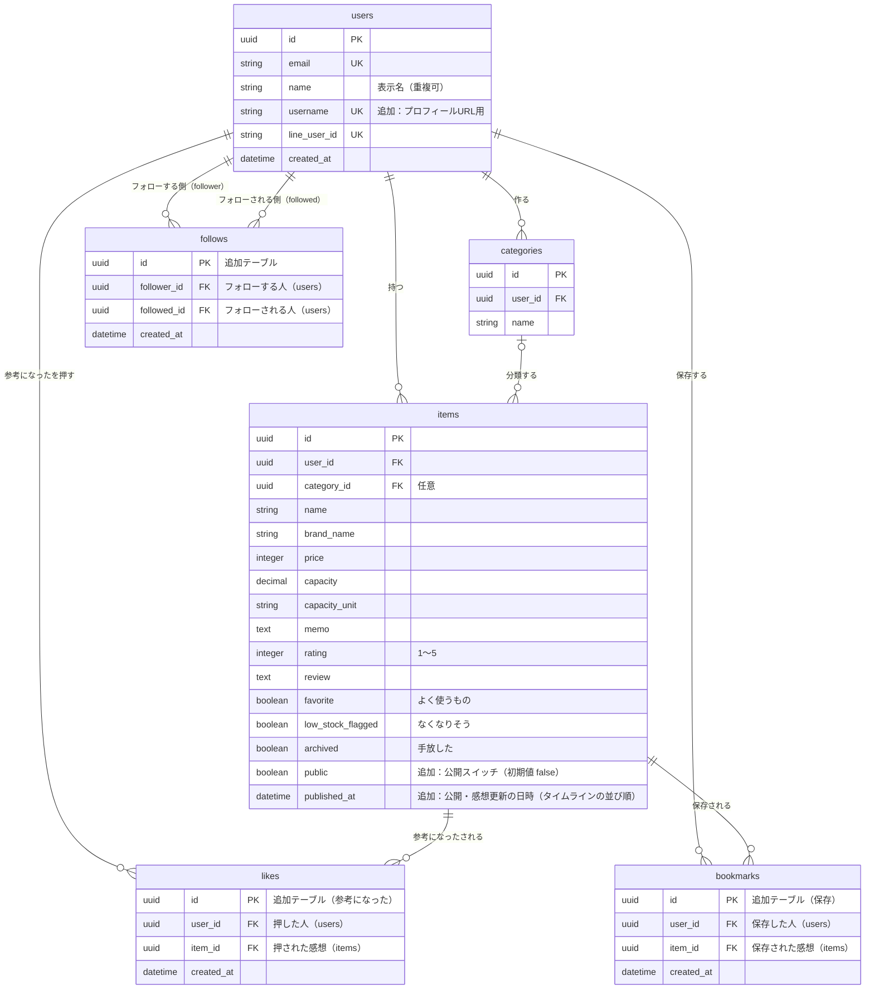

# 共有機能 設計メモ（フォロー・タイムライン・参考になった・保存）

> **ステータス: 検討中**（2026-10-08）
> リファクタリングが終わってから実装に入る。それまでは未決定事項を1つずつ詰めていく。

## 目的

自分の感想を公開し、好みが近い人の感想を見られるようにする。
知らない大勢の平均点ではなく、「この人が気に入っているもの」を参考に選べるようにする。
参考になった感想には「参考になった」で気持ちを伝え、あとで見返したい感想は自分のページに保存できるようにする。

商品（アイテム）はみんなで共有しない。見る単位は「その人の持ち物と感想」なので、既存のテーブルは作り変えない（商品と持ち物の分離や、既存データの移行はしない）。必要なカラムとテーブルを追加するだけで作る。

## 機能の全体像

```
［ユーザー検索］ ──→ ［プロフィール］ ──→ フォローする
                      その人が公開した感想の一覧
                             │
                             ▼
［タイムライン］ フォローしている人が公開・更新した感想（とアイテム）
                             │
                             ├─→ 参考になった（書いた人に数で伝わる）
                             └─→ 保存（自分だけの「保存した感想」一覧に入る）
```

| 画面 | 中身 |
|---|---|
| ユーザー検索 | 名前などで人を探す。全ユーザーが検索対象 |
| プロフィール | その人が公開している感想（とアイテム）の一覧。フォローボタン |
| タイムライン | フォローしている人が公開・更新した感想が、新しい順に並ぶ |
| 保存した感想 | 自分が保存した、他の人の感想の一覧。自分だけが見られる |

## 決定事項

| 論点 | 決定内容 |
|---|---|
| 公開の単位 | 持ち物ごとに公開スイッチを持つ。**初期値は非公開**（既存ユーザーのデータが勝手に出ないように） |
| 公開できる条件 | **星評価があるものだけ**。感想がないものは公開する意味がないため |
| タイムラインの並び順 | 公開した日時、または公開中に感想（評価・レビュー）を更新した日時の新しい順。しばらく経って感想を書き直すこともあるため、更新でも上に出す。メモや価格など、感想以外の更新では上げない |
| 検索の対象 | 全ユーザー。公開範囲を絞る仕組みは作らず、プライバシーは「感想を非公開にする」ことで守る |
| フォローしていないときのタイムライン | 「誰かをフォローしてみよう」という案内と、ユーザー検索へのリンクだけを出す |
| 手放したアイテム | 公開できる。手放した理由も参考になるため。「手放した」の印を付ける |
| 公開する情報 | 最低限「どのアイテムか」が分かる情報と、感想だけ。商品名・ブランド名・画像・星評価・レビュー・手放したかどうか。価格・容量・メモ・カテゴリ・よく使う・なくなりそうは公開しない |
| 他の人の感想への反応 | 「参考になった」（いいね）と「保存」の両方を作る。参考になったは書いた人への反応、保存は自分があとで見返すためのもの |

## リリースの進め方

**段階的にリリースする。** それ単体でも役に立つ小さな単位に分け、1つずつ普通の issue・PR の流れで作ってデプロイする。作りかけの機能を隠す仕組み（フィーチャーフラグ）は使わない。

| リリース | 中身 | 役に立つこと |
|---|---|---|
| 0回目（準備） | 利用規約・プライバシーポリシーの更新 | 公開機能を始める前に必要（既存ユーザーがいるため） |
| 1回目 | 感想の公開スイッチ、ログインなしで見られる公開ページ、LINE で送るボタン | 友人・家族に感想をシェアできる（ユーザーからの要望が多い） |
| 2回目 | プロフィールページ（その人の公開した感想の一覧） | プロフィールごと LINE で送れる |
| 3回目 | ユーザー検索、フォロー、タイムライン | 好みが近い人の感想を追える |
| 4回目 | 参考になった、保存 | 書いた人に気持ちを伝え、候補を手元に残せる |

migration はカラム・テーブルを「足すだけ」にし、既存データを消したり作り変えたりしない。公開スイッチの初期値は非公開なので、どの段階でデプロイしても既存ユーザーのデータは公開されない。

## 未決定事項

- [ ] ナビゲーション：タイムラインと検索をどこに置くか（スマホの下メニューはすでに4つある）
- [ ] 検索する項目：表示名（name）、username、またはその両方
- [ ] username の決め方：既存ユーザーへの割り当て方法、変更できるか
- [ ] ゲストの扱い（案：閲覧のみで、公開・フォローは不可）
- [ ] 公開した感想を非公開に戻したとき、フォロワーのタイムラインから消えることの確認（作りとしては自然に消える）
- [ ] 利用規約・プライバシーポリシーの更新内容（既存ユーザーがいるため、公開前に必要）

### 参考になった（いいね）
- [ ] 数を見せるか（仮：見せる。感想の下に「参考になった 3」。書いた人にも他の人にも見える）
- [ ] 誰が押したかを見せるか（仮：最初は見せない。数だけ）
- [ ] 書いた人に通知するか（仮：最初は通知機能を作らない。通知は既読管理などを含む別の機能として、あとで検討）
- [ ] 自分の感想にも押せるか（仮：押せない）
- [ ] 感想を書き直したときの扱い（仮：参考になったはそのまま残す）

### 保存
- [ ] 保存した感想を、書いた人があとで書き直したら（仮：常に最新の内容を見せる。保存した時点の内容は残さない）
- [ ] 書いた人が非公開にしたら（仮：保存一覧から見えなくする。保存の記録は残し、再び公開されたら見えるようにする）
- [ ] 書いた人がアイテムを削除したら（仮：保存の記録も一緒に消す）
- [ ] 自分のアイテムも保存できるか（仮：できない。自分のものは持ち物で見られる）
- [ ] 保存したことを書いた人に知らせるか（仮：知らせない。数も出さない）
- [ ] （あとで）保存した感想から、アイテム名・ブランド名を入れた状態で持ち物の登録画面を開けるようにするか

## ER図（実装後）



`items` は今までどおり画像を1枚まで添付できる（Active Storage）。

### 変更点

| テーブル | 変更 | 中身 |
|---|---|---|
| users | カラム追加 | `username`（string、一意、NOT NULL） |
| items | カラム追加 | `public`（boolean、default: false、NOT NULL） |
| items | カラム追加 | `published_at`（datetime、null 可。非公開のあいだは使わない） |
| follows | テーブル追加 | `follower_id`、`followed_id`（どちらも users への外部キー） |
| likes | テーブル追加 | `user_id`、`item_id`（参考になった） |
| bookmarks | テーブル追加 | `user_id`、`item_id`（保存） |

### 制約とインデックス

- `users.username`：一意インデックス
- `follows`：`(follower_id, followed_id)` の組み合わせで一意インデックス（同じ人を2回フォローできない）
- `follows`：自分自身はフォローできない（model のバリデーションと、DB の CHECK 制約）
- `items`：`(user_id, public, published_at)` のインデックス（プロフィールとタイムラインの取得用）
- `likes`：`(user_id, item_id)` の組み合わせで一意インデックス（同じ感想に2回押せない）
- `bookmarks`：`(user_id, item_id)` の組み合わせで一意インデックス（同じ感想を2回保存できない）
- `likes`・`bookmarks`：アイテムを削除したら一緒に消す（外部キーの on_delete: :cascade、または model の `dependent: :destroy`）

### 公開まわりのルール（model にまとめる）

- 星評価（`rating`）がないアイテムは、公開スイッチをオンにできない
- 公開中に星評価を消した場合は、自動で非公開に戻す
- 公開スイッチをオンにしたとき、または公開中に `rating` / `review` を更新したときに、`published_at` を現在時刻にする
- ゲストのアイテムは公開できない（ゲストの扱いが決まったら確定）
- 公開ページで表示する項目は、1か所（メソッドや partial）にまとめ、非公開の項目がうっかり出ないようにする
- 参考になった・保存は、公開中の他人の感想にだけできる（自分の感想・非公開の感想にはできない）
